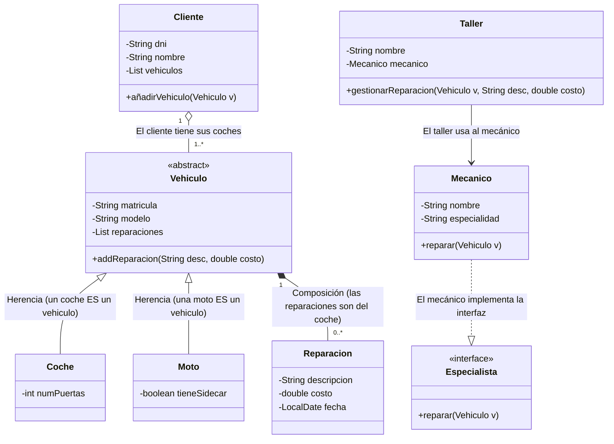
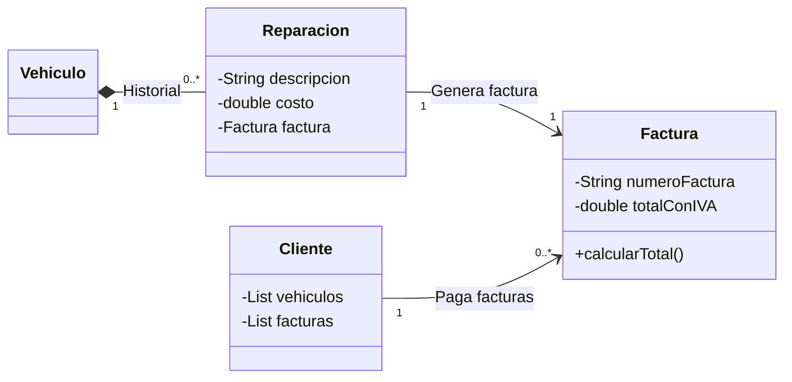

# Explicación de mis Diagramas UML - Taller de Vehículos

En este documento explico cómo he organizado las clases de mi proyecto usando dibujos (UML). He dividido el trabajo en dos partes: el diseño inicial y los cambios que hice después.

---

## 1. El Diseño Inicial (Fase 1)

Este es el primer esquema que hice para entender cómo funciona el taller.

### Mi Diagrama UML

### ¿Por qué lo he hecho así?

- **Herencia**: He puesto `Vehiculo` como clase abstracta porque no existen "vehículos" a secas, siempre son coches o motos. Así ahorro código.
- **Composición (Rombo negro)**: He puesto un rombo negro entre `Vehiculo` y `Reparacion` porque las reparaciones no existen solas en el aire, siempre van pegadas a un coche o moto concreta.
- **Agregación (Rombo blanco)**: Entre `Cliente` y `Vehiculo` hay un rombo blanco porque el coche puede existir aunque el cliente no esté en la base de datos (por ejemplo, si lo vendemos).
- **Interfaz**: Uso `Especialista` para que el código sea más ordenado.

---

## 2. Cambios y Nuevas Clases (Ingeniería Inversa)

Después de empezar a programar, me di cuenta de que hacían falta facturas para cobrar. Así que las añadí y actualicé el dibujo.

### Diagrama Actualizado

### ¿Qué he añadido?

- **Clase Factura**: Para guardar el número de factura y el precio final con el IVA.
- **Relación 1 a 1**: Cada reparación tiene su propia factura.
- **Trazabilidad**: Ahora podemos saber qué factura pertenece a qué reparación y qué cliente la ha pagado.

---

## 3. Conclusiones

Hacer el UML me ha servido para no perderme cuando el proyecto se hace más grande. Al principio parece que pierdes tiempo dibujando, pero luego se programa mucho más rápido porque ya sabes dónde va cada cosa.
