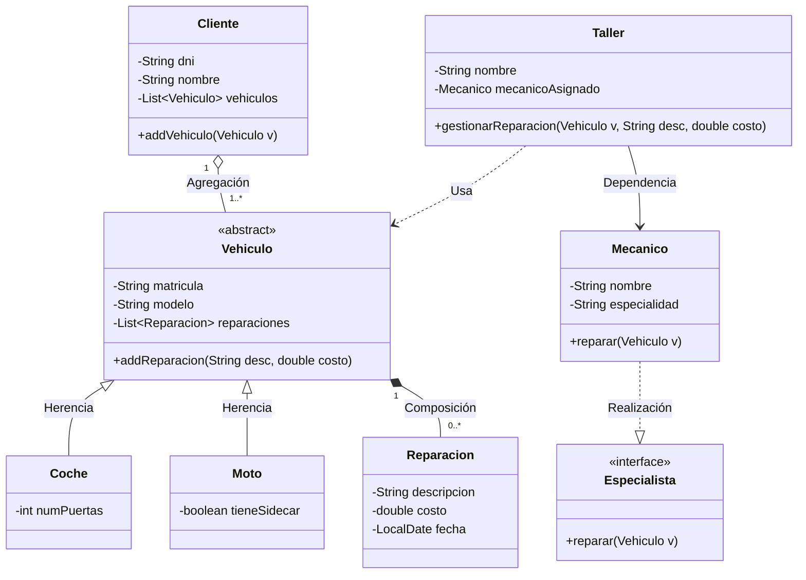
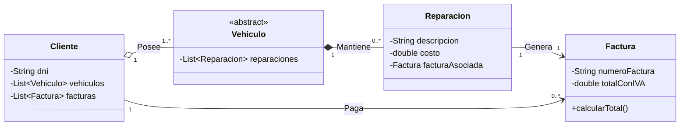

# Documento de Diseño UML - Sistema de Gestión de Taller

Este documento centraliza y explica todas las estructuras UML que componen el Sistema de Gestión de un Taller de Vehículos, detallando la lógica de diseño aplicada en cada fase.

---

## 1. Modelo de Diseño Inicial (Clases y Relaciones)

Este diagrama representa la estructura base del sistema, definiendo los componentes principales y cómo interactúan entre sí para cumplir con los requisitos iniciales.

### Diagrama UML (Fase 1)

### Explicación de las Estructuras:

- **Herencia (Vehiculo, Coche, Moto)**: `Vehiculo` es una clase abstracta que define atributos comunes. `Coche` y `Moto` heredan de ella, especializando el comportamiento y añadiendo atributos propios (puertas o sidecar).
- **Composición (Vehiculo - Reparacion)**: La relación con el rombo relleno indica que la vida de una `Reparacion` está ligada a la del `Vehiculo`. No existen reparaciones sin vehículo asociado.
- **Agregación (Cliente - Vehiculo)**: Un `Cliente` posee vehículos. Se usa agregación (rombo vacío) porque los vehículos pueden existir independientemente del cliente en ciertos contextos (aunque aquí se asocian).
- **Interfaz (Especialista)**: Define un contrato de comportamiento (`reparar`). Esto permite el polimorfismo, donde `Mecanico` es una implementación concreta.
- **Dependencia y Asociación (Taller, Mecánico, Vehículo)**: El `Taller` actúa como orquestador, utilizando a un `Mecanico` para operar sobre los `Vehiculos`.

---

## 2. Modelo de Diseño Extendido (Ingeniería Inversa)

Tras la implementación de nuevas funcionalidades (gestión de pagos), el diseño se actualizó para incluir la clase `Factura`. Este diagrama refleja el estado actual del sistema tras la evolución del código.

### Diagrama UML (Fase 4 - Post-Extensión)

### Explicación de las Adiciones:

- **Clase Factura**: Se introduce para gestionar el aspecto económico de las reparaciones. Contiene el número de factura y el total calculado.
- **Asociación Reparación - Factura**: Cada `Reparacion` genera exactamente una `Factura` (Relación 1:1).
- **Relación Cliente - Factura**: El `Cliente` se asocia con sus facturas para mantener un registro de los pagos realizados (Relación 1:N).
- **Flujo de Trabajo**: Este diseño permite trazar desde el cliente hasta la factura, pasando por el vehículo y la reparación correspondiente, asegurando la trazabilidad total del servicio.

---

## 3. Justificación de Decisiones de Diseño

- **Uso de Interfaces**: Se mantuvo `Especialista` para asegurar que el sistema sea escalable (por ejemplo, para añadir robots o subcontratas sin cambiar el código del taller).
- **Persistencia de Datos**: La composición entre `Vehiculo` y `Reparacion` garantiza que la integridad referencial se mantenga a nivel de lógica de negocio: si borramos un vehículo, su historial se borra con él.
