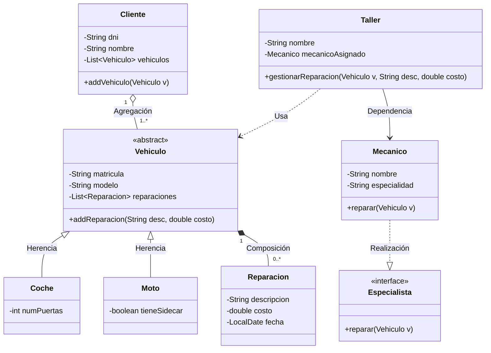
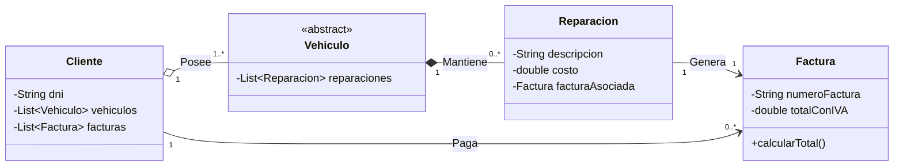

# Sistema de Gestión de un Taller de Vehículos

Este proyecto documenta el diseño e implementación de un sistema de gestión para un taller mecánico, aplicando principios de **Ingeniería del Software**, diseño **UML** y conceptos de **Ingeniería Directa e Inversa**.

---

## 1. Introducción
El objetivo de este proyecto es modelar y desarrollar una solución robusta para la gestión operativa de un taller de vehículos. El sistema permite administrar la relación entre clientes y sus vehículos, el seguimiento de reparaciones mediante composición, y la asignación de tareas a especialistas (mecánicos).

Se pone especial énfasis en:
- El uso de **patrones de diseño orientados a objetos**.
- La representación visual mediante **diagramas Mermaid**.
- La transición fluida entre el diseño (UML) y el código (Java).

---

## 2. Enunciado del Problema
Se requiere un sistema que gestione los siguientes elementos:
- **Vehículos**: Se distinguen entre *Coches* y *Motos*, ambos con matrícula y modelo.
- **Clientes**: Un cliente puede ser dueño de uno o varios vehículos.
- **Reparaciones**: Cada vehículo tiene un historial de reparaciones. La relación es de **composición**, lo que implica que una reparación no tiene sentido sin un vehículo asociado.
- **Especialista**: Interfaz que define el comportamiento necesario para realizar una reparación mediante el método `reparar()`.
- **Mecánico**: Clase que implementa la interfaz `Especialista`.
- **Taller**: Clase encargada de la lógica de negocio, que utiliza a un `Mecanico` para asignar y ejecutar reparaciones sobre los vehículos.

---

## 3. Fase 1: Diseño (UML con Mermaid)

A continuación se presenta el modelo inicial que captura los requisitos del sistema:



---

## 4. Fase 2: Ingeniería Directa (Código Java)

En esta fase, el diseño UML se traduce a esqueletos de clases en Java, asegurando que las relaciones (herencia, composición, agregación, etc.) se implementen correctamente mediante el uso de tipos de datos, listas y modificadores de acceso.

### Traducción de Relaciones
- **Herencia (`<|--`)**: Uso de la palabra clave `extends`.
- **Composición (`*--`)**: La clase contenedora (`Vehiculo`) es responsable de instanciar los objetos contenidos (`Reparacion`).
- **Agregación (`o--`)**: La clase contenedora (`Cliente`) mantiene una lista de objetos que pueden existir fuera de ella.
- **Realización (`..|>`)**: Uso de la palabra clave `implements`.
- **Dependencia/Asociación (`-->`)**: Atributos de clase o parámetros en métodos.

### Esqueletos de Clases

#### Interfaz Especialista
```java
public interface Especialista {
    void reparar(Vehiculo v);
}
```

#### Clase Mecánico (Implementación)
```java
public class Mecanico implements Especialista {
    private String nombre;
    private String especialidad;

    @Override
    public void reparar(Vehiculo v) {
        // Lógica de reparación
    }
}
```

#### Clase Vehículo (Abstracta y Composición)
```java
public abstract class Vehiculo {
    private String matricula;
    private String modelo;
    private List<Reparacion> reparaciones; // Composición

    public void addReparacion(String desc, double costo) {
        // Composición: creación interna
    }
}
```

#### Clases Coche y Moto (Herencia)
```java
public class Coche extends Vehiculo {
    private int numPuertas;
}

public class Moto extends Vehiculo {
    private boolean tieneSidecar;
}
```

#### Clase Cliente (Agregación)
```java
public class Cliente {
    private String dni;
    private String nombre;
    private List<Vehiculo> vehiculos; // Agregación (1..*)

    public void addVehiculo(Vehiculo v) {
        // El vehículo ya existe, se agrega a la lista
    }
}
```

#### Clase Taller (Dependencia)
```java
public class Taller {
    private String nombre;
    private Mecanico mecanicoAsignado; // Asociación

    public void gestionarReparacion(Vehiculo v, String desc, double costo) {
        // Dependencia de Vehiculo y Mecanico
    }
}
```

---

## 5. Fase 3: Interpretación y Decisiones de Diseño

En esta etapa se justifica la arquitectura elegida, analizando las relaciones entre objetos y los beneficios de los patrones aplicados.

### ¿Por qué Reparación es Composición respecto a Vehículo?
En el modelo UML, se ha representado la relación entre `Vehiculo` y `Reparacion` mediante un rombo relleno (**Composición**):
- **Dependencia de Existencia**: Una `Reparacion` no tiene sentido por sí misma fuera del contexto de un `Vehiculo`. Si un vehículo se elimina definitivamente del sistema del taller, su historial de reparaciones debe desaparecer con él.
- **Gestión de Ciclo de Vida**: El `Vehiculo` es el responsable de crear y destruir sus propias instancias de `Reparacion`. En el código, esto se traduce en que la instanciación de `Reparacion` sucede dentro de los métodos de la clase `Vehiculo`, impidiendo que existan "reparaciones huérfanas".

### Ventajas de usar la Interfaz Especialista
El uso de una interfaz para definir a los mecánicos o entidades que reparan ofrece beneficios clave:

1.  **Polimorfismo**: La clase `Taller` no necesita saber qué tipo específico de mecánico está trabajando. Puede tratar a cualquier objeto que implemente `Especialista` de forma genérica, invocando el método `.reparar()`.
2.  **Flexibilidad**: Permite extender el sistema fácilmente. Si en el futuro el taller incorpora "Mecánicos Externos", "Robots de Reparación" o "Sistemas Automáticos", solo hará falta crear una nueva clase que implemente la interfaz sin modificar la lógica existente en `Taller`.
3.  **Desacoplamiento (Low Coupling)**: El `Taller` depende de una abstracción (`Especialista`) y no de una implementación concreta (`Mecanico`). Esto facilita el mantenimiento y las pruebas unitarias (unit testing), ya que se pueden usar objetos simulados (*mocks*) que cumplan con la interfaz.
4.  **Cohesión**: Cada clase se centra en su responsabilidad única, delegando la acción de reparar a la entidad especializada definida por la interfaz.

---

## 6. Fase 4: Ingeniería Inversa y Extensión

La **Ingeniería Inversa** es el proceso de analizar un sistema de software para identificar sus componentes y relaciones, permitiendo generar una representación de diseño a partir de código ya existente.

### Implementación Directa en Java
En esta fase, se decidió extender las funcionalidades del taller para incluir la gestión de cobros. Para ello, se añadió la clase **Factura** directamente en el código fuente (`Factura.java`) sin pasar previamente por una fase de diseño visual.

```java
public class Factura {
    private String numeroFactura;
    private double baseImponible;
    private double totalConIVA;
    // ... métodos de cálculo
}
```

### Generación Automática del Nuevo UML
Tras la modificación del código, se procedió a realizar la "Ingeniería Inversa" para actualizar la documentación. Este nuevo diagrama UML refleja cómo la clase `Factura` se integra en el ecosistema:
- Una **Reparación** ahora está asociada a una única **Factura** (Asociación 1:1).
- El **Cliente** mantiene una relación con sus facturas para el seguimiento de pagos.

### Diagrama UML Actualizado (Post-Extensión)



---

## 7. Conclusiones Finales
La realización de este proyecto demuestra la importancia de una fase de diseño sólida antes de la codificación. El uso de **Mermaid** ha facilitado la iteración rápida sobre el modelo, permitiendo que la **Ingeniería Directa** sea un proceso casi automático y coherente. La posterior **Ingeniería Inversa** permitió adaptar el sistema a nuevas necesidades de negocio sin romper la arquitectura existente.