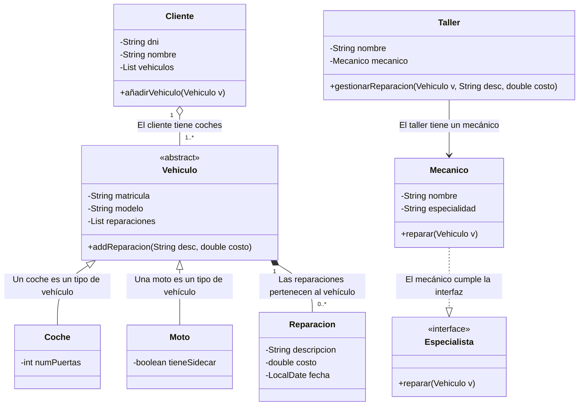
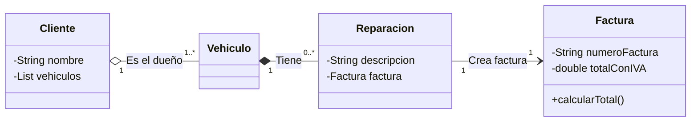

# Mi Proyecto: Taller de Vehículos (Tarea 6.3)

Proyecto para la asignatura de Entorno de Desarrollo. Consiste en crear un sistema para gestionar un taller mecánico usando Java y diagramas UML.

---

## 1. ¿De qué va el proyecto?

El objetivo es hacer un programa que nos ayude a llevar el control de un taller. Tenemos que guardar los datos de los clientes, sus coches y motos, y las reparaciones que se les hacen. También he incluido mecánicos que hacen el trabajo y facturas que se generan al terminar.

He intentado aplicar lo que hemos visto en clase:

- **Herencia**: Para no repetir código con los coches y las motos.
- **Interfaces**: Para definir qué tiene que hacer un mecánico.
- **Diagramas Mermaid**: Para que se vea bien el diseño antes de programar.

---

## 2. Lo que pide el ejercicio

El sistema tiene estas partes:

- **Vehículos**: Hay coches (con puertas) y motos (con o sin sidecar).
- **Clientes**: Personas que traen sus vehículos al taller.
- **Reparaciones**: Lo que le hacemos al vehículo (qué se ha roto y cuánto cuesta).
- **Mecánico**: La persona que arregla el coche. He usado una **interfaz** porque así es más fácil añadir otros tipos de trabajadores luego.
- **Taller**: Es el sitio donde pasa todo y se organizan las reparaciones.

---

## 3. Mi Diseño UML

He dibujado este esquema para aclarar cómo se conectan las clases entre sí:



---

## 4. Cómo lo he pasado a Java

He creado las clases siguiendo el diagrama. Aquí explico un poco cómo lo he hecho:

- **Herencia**: He usado `extends` para que `Coche` y `Moto` hereden de `Vehiculo`. Así no tengo que poner la matrícula y el modelo en todas las clases.
- **Lista de reparaciones**: Cada vehículo tiene un `ArrayList` para ir guardando lo que le vamos arreglando.
- **Interfaz Especialista**: He creado una interfaz muy sencilla con el método `reparar`. Luego la clase `Mecanico` usa `implements` para asegurar que sabe hacer su trabajo.
- **Encapsulamiento**: He puesto los atributos como `private` y he creado los métodos para acceder a ellos.

---

## 5. Notas sobre el diseño

- **Reparaciones y Vehículos**: He pensado que si borras un vehículo, no tiene mucho sentido guardar sus reparaciones, por eso están tan unidas.
- **Uso de Interfaces**: Aunque parezca un poco lío al principio, usar `Especialista` viene muy bien por si en el futuro el taller contrata a un robot o a un autónomo.

---

## 6. Extras: Facturas e Ingeniería Inversa

Además de lo básico, he añadido una clase `Factura`. Lo hice directamente en el código porque me di cuenta de que faltaba.

**Ingeniería Inversa**: Significa que una vez que tengo el código escrito, vuelvo atrás para actualizar mi dibujo (diagrama).

Así quedaría el diseño ahora con las facturas:



---

## 7. Conclusión

Este ejercicio me ha servido para entender mejor cómo organizar las clases antes de empezar a picar código. Al principio cuesta un poco ver la diferencia entre agregación y composición, pero dibujándolo se entiende mucho mejor.


```

```
